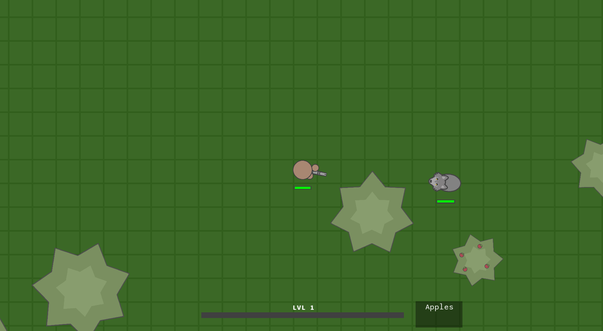
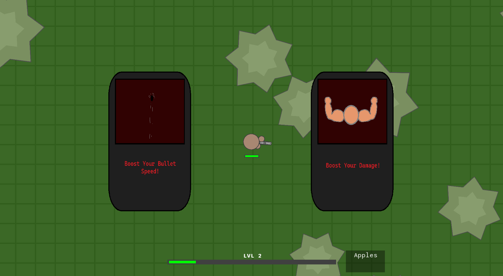
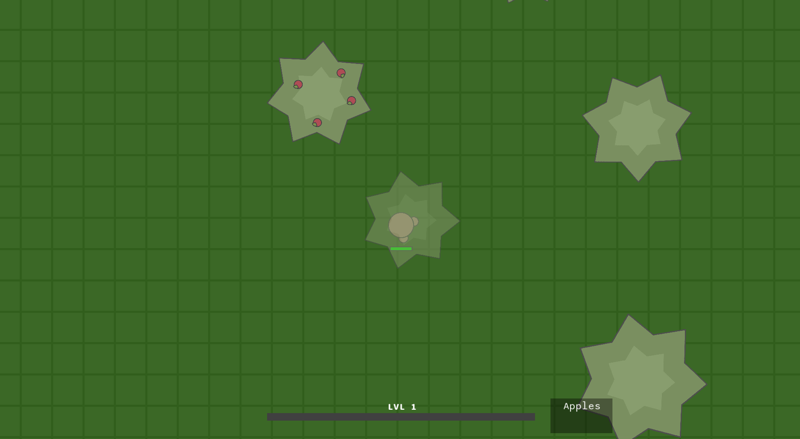
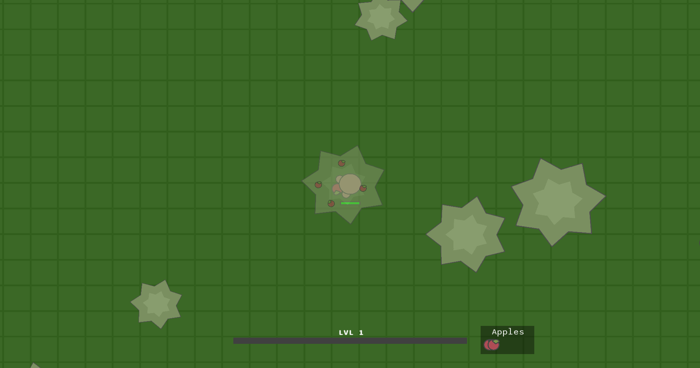

# Hunting Season
This is the final project for CS151, running on SFML, made by Niall Murray and William Wotherspoon.
12/3/2024

**GAME INTRODUCTION:**

Hello and Welcome to hunting Season. Your mission is to survive the wild beasts by fighting them with the available weapons. Each beast defeated will award experience that contributes towards the player level. After each level up an option of upgrades will appear with a small chance for a few special upgrades. Additionally standing under an apple tree while not holding a weapon allows you to pick up apples that can be consumed to regain health. Once you have been defeated your score will be displayed and added to the scores file. The player score is based off of the level achieved as well as any extra experience towards the next level. The max level is 15 once this is achieved the player will be awarded with a choice of one of the special upgrades and the game will enter endless mode.

## CONTROLS:

Move Up: W
Move Left: A
Move Left: S
Move Right: D

Swap To Weapon: 2
Swap To Fists: 1
Shoot Weapon: Space
Pick Apple: R
Eat Apple: E

## GAMEPLAY:

### How to Run

    Step 1: Compile the program if it hasn't compiled already
    ```
    make
    ```

    Step 2: Run the game
    ```
    ./huntingSeason
    ```

    Step 3: Have fun!

### Welcome to The Wild


When you first hit play, you will be welcome with an expansive dynamic map with different types of trees. Utilize swapping from weapon and fists using the controls to move around faster incase you need to run!
The objective of the game is to hunt enough animals to reach the highest level: Level 15. But beware, the higher level you are, the more wolves will spawn. Not all is hopeless, however. At level 15, you'll be presented with guarenteed Legendary Cards, letting you choose from the three Super Weapons to enter endless mode. Have fun!

### Getting XP



Control your aim with the mouse and point your cursor towards attacking enemies. Press space to fire a bullet from your gun to injure, and eventually kill the dangerous animals. Watch out for wolves!

### Leveling Up



When your level bar fills, you'll be presented with a random selection of upgrades! Choose what you want to increase the power of your weapon, and work to the next level. Look out for Legendary Cards containing Super Weapons!

### Using Trees



If you're scared or low on health, don't be afraid to hide under the trees! Enemies will lose sight of you within seconds. However, if the enemy is right on your trail, the will follow you into the tree! Beware of hiding animals!

### Picking and Eating Apples



For safety, make sure to find an apple tree and fill your apple basket! When under the tree, swap to your fists and press 'R' to collect an apple every second. To eat when low on health, just hold your apples in your fists and press 'E' to consume!

Good luck and enjoy!